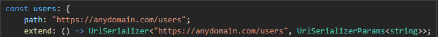

## RequiredEnv

##### What problem are we solving?

```javascript
const serializer = new UrlSerializer(root)
const users = serializer.path('users').build()
```



```javascript
const user = users.extend().param('userId').build()
```


```javascript
const posts = user.extend().path('posts').build()
```


```javascript
const post = posts.extend().param('postId').build()
const usersLink = users.link({})
const userLink = user.link({ ':userId': '10' })
const postsLink = posts.link({ ':userId': '10' })
const postLink = post.link({ ':userId': '10' as const, ':postId': '20' as const })
```


```javascript
const extendedLink = postLink.extend().path('likes').param('likeId').path('user').build().link({
    ':likeId': '30',
})
```


