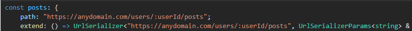
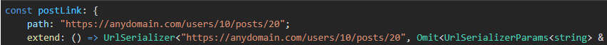

## UrlSerializer

##### What problem are we solving?

When developing a large application, we have a large set of routes and we all store them differently, and if we change the domain or the path in the route, we need to change from one to all routes. I'd like to have route inheritance and IDE hints for quality DX. This class provides inheritance from route, link and query parameters.

```javascript
const serializer = new UrlSerializer(root)
const users = serializer.path('users').build()
```


```javascript
const user = users.extend().param('userId').build()
```


```javascript
const posts = user.extend().path('posts').build()
```



```javascript
const post = posts.extend().param('postId').build()
const usersLink = users.link({})
const userLink = user.link({ ':userId': '10' })
const postsLink = posts.link({ ':userId': '10' })
const postLink = post.link({ ':userId': '10' as const, ':postId': '20' as const })
```



```javascript
const postLink = post.link({ ':userId': '10' })
```


```javascript
const extendedLink = postLink.extend().path('likes').param('likeId').path('user').build().link({
    ':likeId': '30',
})
```


---
